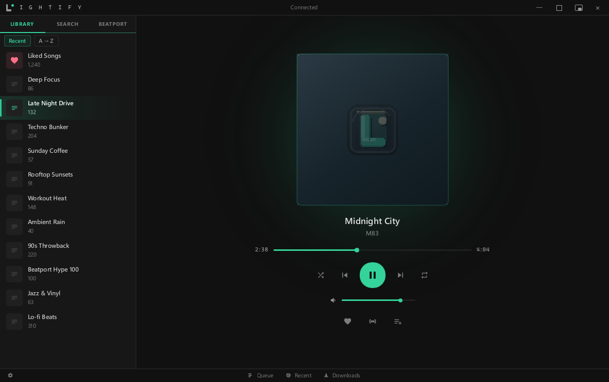

# Lightify

**A small, fast Windows player for your Spotify library.**

[](https://github.com/JunkfoodJon/Lightify/releases/latest)
[](#download)
[](https://www.rust-lang.org)
[](https://slint.dev)
[](LICENSE.md)
[](#download)

Lightify is a native Windows app written in Rust with the [Slint](https://slint.dev) UI
toolkit. There's no web browser hidden inside it, and the part that plays your music runs
in the same small program. It plays your library, your queue and your searches, and
leaves the podcast storefront to Spotify.

<p align="center">
  
</p>

> **Status:** stable and used daily by its author (2.x). It's a one-person project, so
> expect the odd rough edge; bug reports are welcome in
> [Issues](https://github.com/JunkfoodJon/Lightify/issues).

> Not affiliated with, endorsed by, or connected to Spotify.

## Download

**Installer:** [lightify.stream](https://lightify.stream) ·
**Setup guide:** [devappinstall.md](devappinstall.md)

Needs a **Spotify Premium** account and **Windows 10 or 11** (64-bit). The installer
isn't code-signed yet, so Windows SmartScreen may say the publisher is unknown; choose
*More info*, then *Run anyway*. Checksums for every download are in
[SHA256SUMS.txt](https://lightify.stream/downloads/SHA256SUMS.txt). Check yours in
PowerShell and compare:

```powershell
Get-FileHash .\Lightify_2.2.3_x64-setup.exe -Algorithm SHA256
```

If you'd rather not trust a prebuilt file, [build it yourself](#build-from-source).

## Features

- **Plays on its own.** Lightify is its own speaker in Spotify Connect; the Spotify app
  doesn't need to be installed or open.
- **Your whole library.** Playlists with their covers, Liked Songs, and type-to-filter on
  any list.
- **Search that finds things.** A top result first, then songs, artists, albums and
  playlists with artwork, recent searches, and more results as you scroll.
- **A queue you can trust.** Shows what will really play next, remembers it across
  restarts, and offers to pick up where you left off.
- **Stations** seeded from any song, queued behind what's playing.
- **Feels like Windows.** Track and cover in Windows' media controls and on the lock
  screen, play and skip from the taskbar preview, media keys, mini-player sizes and a
  tray icon.
- **Beatport charts** by genre, played from the matching tracks on Spotify.
- **Light on your PC.** One process; about 80 MB in use while open and around 6 MB once
  minimized.

## Build from source

Requirements:

- Windows 10/11 x64
- [Rust](https://rustup.rs) (stable, MSVC toolchain) and Visual Studio Build Tools with the
  "Desktop development with C++" workload
- [CMake](https://cmake.org) on `PATH`, and [LLVM](https://github.com/llvm/llvm-project/releases)
  with the `LIBCLANG_PATH` environment variable pointing at its `bin` folder (for example
  `C:\Program Files\LLVM\bin`). Both are needed to build BoringSSL, which the Beatport
  client uses.

```powershell
cd lightify-shell
cargo build --release --locked
.\target\release\Lightify.exe
```

If a build fails in a C dependency with missing standard headers, make sure the `CC`
environment variable is **not** set; it stops the build from finding the MSVC paths.

To make an installer, install [Inno Setup 6](https://jrsoftware.org/isinfo.php) and run:

```powershell
pwsh -File lightify-shell\scripts\build-installer.ps1 -NoDownloader -NoFfmpeg
```

The first launch shows a Spotify sign-in page. You'll need your own free Spotify
developer app's Client ID; the [setup guide](devappinstall.md) walks through it in about
five minutes.

### Useful flags

`Lightify.exe --shot out.png` renders the UI with sample data to a PNG without opening a
window. The `--selftest-*` flags run built-in checks; the ones that play audio
(`--selftest-queue`, `--selftest-station-clear`, `--selftest-queue-order`) need Lightify
itself closed and briefly play a few seconds at low volume on your account.

## Repository layout

| Path | What it is |
|---|---|
| `lightify-shell/` | The app: UI (`ui/app.slint`), worker, playback engine, Windows integration |
| `lightify-core/` | Spotify session, sign-in, Web API client, Beatport client, data models |
| `lightify-shell/installer/` | Inno Setup script for the Windows installer |

The Downloads panel talks to an optional, separately distributed downloader bridge that
is **not** part of this repository. In builds from this source, downloading reports that
the downloader bridge wasn't found; everything else works as normal.

A few code comments refer to design notes (`PARITY.md`, `UI-PLAN.md`) that are kept out of
this repository.

## Privacy and security

Lightify has no telemetry, analytics, crash reporting or account of its own. It talks to
Spotify (and to Beatport, only when you open a Beatport chart), and everything it keeps
stays in your own Windows profile. [PRIVACY.md](PRIVACY.md) lists exactly what it stores
and what goes over the network. To report a security problem privately, see
[SECURITY.md](SECURITY.md).

## Please read before using

Your use of Spotify and its content is governed by Spotify's own terms. Only use Lightify
with content and services you have the rights to use. The app is an independent project
and is provided as is, without warranty. See [LICENSE.md](LICENSE.md).

## License

Lightify's own code is licensed for **noncommercial use** under the
[PolyForm Noncommercial License 1.0.0](LICENSE.md): you can use, share and change it for
noncommercial purposes, but you can't sell it or use it to make money. Third-party
components keep their own licenses; see [THIRD-PARTY-NOTICES.md](THIRD-PARTY-NOTICES.md).

<a href="https://slint.dev"></a>
